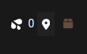

# Stash Markers

Stash markers is a tool that utilizes playbar sprite images to perform image recognition and generate a list of potential markers for a video.

To be used with [Stash](https://github.com/stashapp/stash)

# Stash Userscripts

Installation requires the browser extension [Tampermonkey](https://www.tampermonkey.net/) 

**By default the userscripts only work for `http://localhost:9999`**

> If you access Stash from a different address, you will need to modify the userscript when you install it.
>
> Find the line `// @match       http://localhost:9999/*` and replace `http://localhost:9999/*` with your Stash address.

[INSTALL USERSCRIPT](dist/stashmarkers.user.js?raw=1)

Once installed, A new icon will show on a scene's page next to the organized button.

